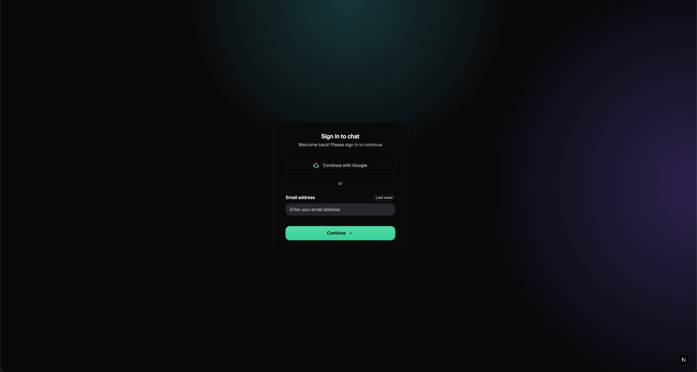
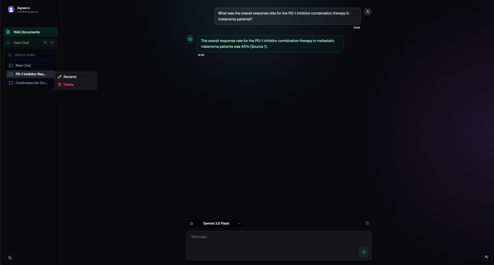
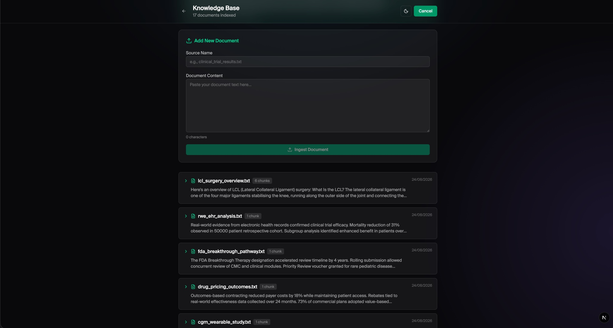

# LangChain + Hugging Face AI Infrastructure


A polyglot AI application infrastructure combining **Next.js (App Router)**, **Convex** (reactive real-time database), **Python/FastAPI** (AI orchestration via LangChain + Hugging Face), **Tailwind v4**, and **shadcn/ui**.

## Screenshots

### Login


### Chat with RAG


### Knowledge Base & RAG Documents


## Architecture Overview

This project uses a decoupled, polyglot backend architecture:

- **Frontend** — Next.js (App Router) with React Server Components and client components for the chat surface.
- **State + Database** — Convex for schema-driven, real-time state management (conversation history, messages, AI-generated titles).
- **AI Backend** — Python (FastAPI + uvicorn with hot-reload) for streaming token support and multi-provider LLM orchestration via LangChain.
- **UI Layer** — Tailwind v4 with shadcn/ui components, a Claude-inspired "unboxed" chat layout, and frosted-glass composer.

```
┌──────────────────────────────────────────────────────────────┐
│  Next.js App Router (src/app)                               │
│  ├── page.tsx                 ← landing / hero composer     │
│  ├── layout.tsx               ← providers + metadata        │
│  ├── chat/[conversationId]/   ← active chat surface        │
│  └── api/chat/title/          ← AI title generation         │
│         │                                                    │
│         ▼                                                    │
│  Convex (reactive queries / mutations)                      │
│  ├── convex/conversations.ts                                 │
│  └── convex/messages.ts                                      │
│         │                                                    │
└─────────┼────────────────────────────────────────────────────┘
          │
          ▼
  Python FastAPI (python-service/main.py)
  ├── LangChain ChatOpenAI chain
  └── Hugging Face router endpoint (multi-model support)
```

## Getting Started

### Prerequisites

- Bun (preferred) or Node.js v18+
- Python 3.13+ (with venv support)
- Convex CLI installed (`bunx convex` or `npx convex`)

### Environment Configuration

Two environment files are required:

1. **Root `.env.local` (Convex + frontend):**
   - `CONVEX_DEPLOYMENT`
   - `NEXT_PUBLIC_CONVEX_URL`

2. **`python-service/.env` (AI backend):**
   - Copy `python-service/.env.example` → `python-service/.env`
   - Hugging Face / OpenAI / Anthropic / Google keys (as needed by your provider)

### Running the Project

1. **Start Convex + Python AI service (project root):**

```bash
chmod +x start.sh
./start.sh
```

`start.sh` boots Convex dev + uvicorn with `--reload` so Python changes hot-reload without a restart.

2. **Start the Next.js frontend (separate terminal):**

```bash
bun install     # or npm install
bun dev         # or npm run dev
```

Then visit `http://localhost:3000`.

## Project Structure

```
src/
├── app/
│   ├── layout.tsx                   Root layout, metadata + providers
│   ├── page.tsx                     Landing page (hero composer + model picker)
│   ├── chat/[conversationId]/
│   │   └── page.tsx                 Chat surface + sidebar layout
│   └── api/chat/title/route.ts      Conversation title generation (AI)
├── components/
│   ├── providers.tsx                Convex + Theme providers
│   ├── theme-toggle.tsx             Theme switcher
│   ├── chat/
│   │   ├── app-sidebar.tsx          Claude-style conversation sidebar
│   │   ├── chat-window.tsx          Unboxed chat layout with frosted composer
│   │   ├── message-bubble.tsx       User + AI message styles
│   │   └── model-selector.tsx       Model picker component
│   └── ui/                          shadcn/ui + ActionButton, AppDialog, etc.
├── hooks/
│   ├── use-chat.ts                  Per-conversation stream state
│   └── use-chat-session.ts          Empty-chat redirect logic
└── lib/
    ├── locale.ts                    APP_NAME / labels (single source of truth)
    ├── models.ts                    Model registry (HF IDs, display names)
    └── utils.ts                     cn() + helpers

convex/
├── conversations.ts                 Conversations CRUD (+ getFirstEmpty guard)
├── messages.ts                      Messages send + stream
└── schema.ts                        Table schemas

python-service/
├── main.py                          FastAPI service (LangChain + HF router)
└── services/
    ├── llm.py                       LLM provider setup
    ├── chat.py                      Chain definitions
    └── convex_client.py             Convex client for persistence
```

## Key UI/UX Patterns

### Layout & Composer

- **Unboxed chat surface** — Messages flow directly on the page background (no Card container). Sticky frosted-glass composer with `backdrop-blur` + gradient fade mask so messages bleed behind the input.
- **Smart scroll-to-bottom FAB** — Floating Action Button appears only when `scrollHeight - clientHeight > 80px` AND the user has scrolled up. Respects manual scroll during streaming (auto-scroll only snaps to bottom if they were already there).
- **Claude-style multiline composer** — Textarea with Enter-to-send, Shift+Enter for newlines, action buttons anchored bottom-right.
- **Mobile sidebar** — Drawer slides in below the header (offset `top-14` / 56px), not a full-screen overlay, so the header trigger remains clickable.

### State & Conversations

- **Auto AI titling** — First user message of a thread is summarized by the model via `/api/chat/title` and saved to the conversation row. Falls back to truncated first-message text if the title API fails.
- **Empty chat safeguard** — `getFirstEmpty` Convex query ensures "New Chat" reuses an existing message-less thread instead of creating duplicates; the New Chat button is actively _disabled_ (shows `Ban` hover indicator) when an empty thread exists.
- **Rename + Delete dialogs** — Shared `AppDialog` component + `ActionButton` themed variants (green/red/blue/amber/zinc) for consistent theming across actions.
- **Per-model selection** — Model ID tracked on the hero composer and active-chat ModelSelector.

### Accessibility

- All icon-only controls carry `aria-label` + `title` attributes for screen-readers and native hover tooltips.
- Disabled New Chat button shows a `Ban` hover-swap icon indicator (Plus spins away, `Ban` spins in) during creation/loading/empty-chat-exists states, with contextual tooltips explaining _why_ it's disabled.

## Testing the API

Verify the Python backend independently:

```bash
curl -X POST http://127.0.0.1:8000/chat \
     -H "Content-Type: application/json" \
     -d '{"message": "Hello!", "conversationId": "jd744024cd4bh502rk87zycgph8bzfz7"}'
```

## Why Polyglot?

While Next.js is excellent for frontend/API routing, the Python-based FastAPI backend exists for three reasons:

1. **Leverage the AI Ecosystem** — LangChain's Python libraries provide richer provider integrations and agentic orchestration.
2. **Separation of Concerns** — Heavy AI processing is decoupled from the UI, allowing independent scaling.
3. **Synchronized State** — Both TypeScript and Python are first-class Convex citizens writing to the same reactive DB.

## RAG (Retrieval-Augmented Generation)

This project includes a full RAG pipeline that allows the AI to answer questions using your uploaded documents.

### How RAG Works

1. **Ingest Documents** — Upload text via the API or UI. Content is chunked (500 chars, 50 overlap) and embedded using `all-MiniLM-L6-v2` or `text-embedding-3-small` (384 dims).
2. **Store Embeddings** — Chunks are stored in Convex's built-in vector database with 384-dimensional embeddings.
3. **Retrieve Context** — When you ask a question, the system finds the most relevant chunks using vector similarity search.
4. **Augmented Response** — Retrieved context is injected into the LLM prompt, and the AI cites sources in its response.

### RAG API Endpoints

**Ingest text document:**
```bash
curl -X POST http://127.0.0.1:8000/documents/ingest \
  -H "Content-Type: application/json" \
  -H "Authorization: Bearer <convex-token>" \
  -d '{
    "text": "Your document content here...",
    "source": "document_name.txt",
    "metadata": {"category": "healthcare"}
  }'
```

**Ingest from URL:**
```bash
curl -X POST http://127.0.0.1:8000/documents/ingest-url \
  -H "Content-Type: application/json" \
  -H "Authorization: Bearer <convex-token>" \
  -d '{"url": "https://example.com/article"}'
```

**List documents:**
```bash
curl http://127.0.0.1:8000/documents \
  -H "Authorization: Bearer <convex-token>"
```

### Disabling RAG

Pass `useRag: false` in the chat request to skip context retrieval:
```json
{"message": "Hello", "conversationId": "...", "useRag": false}
```

---

## Observability with LangSmith

This project integrates with [LangSmith](https://smith.langchain.com) for LLM observability (free tier available).

### Setup

Add to `python-service/.env`:
```env
LANGCHAIN_TRACING_V2=true
LANGCHAIN_API_KEY=lsv2_pt_...
LANGCHAIN_PROJECT=langchain-rag-chat
```

### What You Get

- **Full trace visualization** of every LangChain call
- **Token usage, latency, cost** tracking
- **Eval datasets** for hallucination detection
- **Zero code changes** — just env vars

---

## Production Hardening

### Input Guardrails

- **Length limits** — Messages capped at 4,000 characters
- **Injection detection** — Blocks common prompt injection patterns
- **Rate limiting** — Configurable via `slowapi`

### Output Guardrails

- **Confidence scoring** — Based on retrieval similarity scores
- **Source citation** — LLM prompted to cite retrieved sources
- **Uncertainty acknowledgment** — Model admits when context is insufficient

### Structured Logging

JSON-formatted logs with trace IDs for production observability:
```json
{"event": "chat_request", "trace_id": "a1b2c3d4", "conversation_id": "...", "use_rag": true}
```

Enable JSON logs in production:
```env
JSON_LOGS=true
LOG_LEVEL=INFO
```

### Health Endpoints

```bash
# Liveness
curl http://127.0.0.1:8000/health

# Readiness (checks Convex + RAG pipeline)
curl http://127.0.0.1:8000/health/ready \
  -H "Authorization: Bearer <convex-token>"
```

---

## Evaluation Harness

Run RAG and response quality tests:

```bash
cd python-service
pytest evals/ -v
```

Test categories:
- `test_rag_retrieval.py` — Chunking, embedding, retrieval accuracy
- `test_response_grounding.py` — Source citation, hallucination detection

---

## Development Commands

**Linting & Formatting (Python):**

```bash
cd python-service
./venv/bin/ruff check . --fix
./venv/bin/ruff format .
```

**Linting & Typechecking (Frontend):**

```bash
bun lint
bun typecheck
```

**Run Evals:**

```bash
cd python-service
pytest evals/ -v
```
